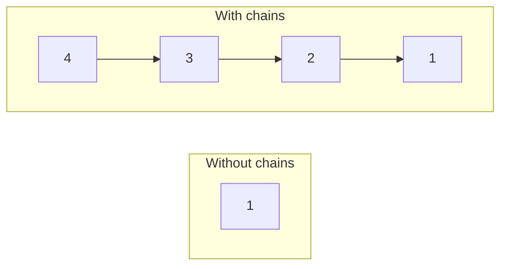
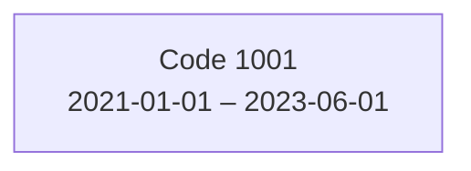
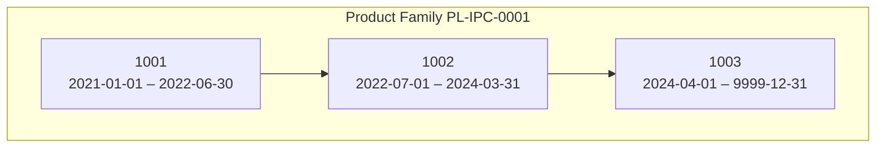
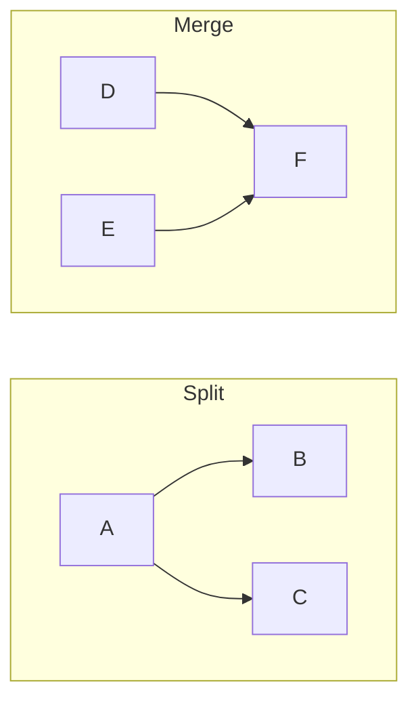
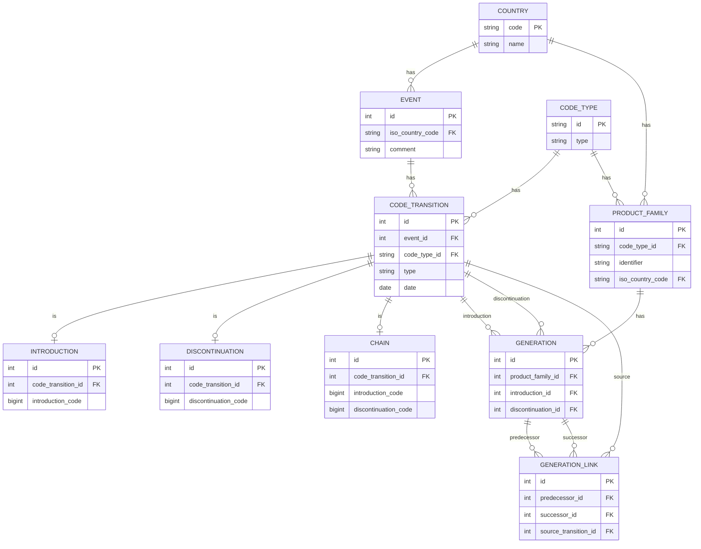

# Case Study: Product Code Families — Demand Forecasting Continuity

## 1. Business Background

### The Problem

Accurate **demand forecasting** is critical for any supply chain — it drives production planning, inventory management, and distribution. One of the most important inputs to a demand forecast is **historical demand data**. To predict how much of a product will sell next month, you need to know how much it sold in previous months.

This sounds simple, but in practice there is a major obstacle: **product code changes**.

### Why Product Codes Change

Every product is identified by a numerical code. In this case study we work with two code types:

- **IPC** — Internal Product Code (a company's internal identifier)
- **GTIN** — Global Trade Item Number (the barcode number used in retail)

These codes change frequently for a variety of reasons:

- **Reformulation** — A shampoo's formula is improved, requiring a new code.
- **Repackaging** — The same product moves from a 250ml to a 300ml bottle.
- **Regulatory changes** — New labelling requirements force a code change.
- **Market restructuring** — Two regional variants are merged into one product, or one product is split into two.

When a code changes, the demand history attached to the old code becomes "orphaned." The new code starts with zero history. From a forecasting perspective, the continuity is broken — the system sees a brand-new product with no past, when in reality it is the same (or very similar) product that has been selling for years.

### The Solution: Chains

The idea is simple: when a product code changes, we record a **chain** — a link that says "the new code is a continuation of the old code." By chaining codes together, we preserve the full demand history across all code changes.

Without chains, every code change means starting from scratch — the forecasting system only sees the history of the current code. With chains, it can follow the links back through every predecessor and access years of continuous data:



## 2. Domain Concepts

### Generation

A **Generation** is a single product code's lifespan — the period between its introduction and its discontinuation. It has a `code`, a `start_date`, and an `end_date` (or `9999-12-31` if still active).



A code can have multiple generations over time (introduced, discontinued, reintroduced later), but their time intervals must never overlap.

### Product Family

A **Product Family** is the set of all generations connected through chain events. Because products can split and merge, the family forms a **Directed Acyclic Graph (DAG)** — each node is a generation and each edge is a chain link.





When forecasting demand for any code, the system looks up its family and aggregates the sales history of every generation in that family.

### Events and Transitions

An **Event** is a business occurrence scoped to a single country. We work with five countries:

| Code | Country |
|------|---------|
| `PL` | Poland |
| `DE` | Germany |
| `US` | United States |
| `JP` | Japan |
| `CN` | China |

Each event contains one or more **Code Transitions**. A transition has a **date**, a **code type** (`"IPC"` or `"GTIN"`), and a **type** — one of the three below:

#### Introduction

A new product code enters the market. Records `introduction_code`. After this event the code is **active**.

#### Discontinuation

An existing code is removed from the market. Records `discontinuation_code`. After this event the code is **discontinued**. You can only discontinue a code that is currently active.

#### Chain

Two codes are linked — one replaces the other. Records both `introduction_code` (successor) and `discontinuation_code` (predecessor). This creates the edge in the family graph. Both codes must already exist in the system.

### Validation Rules

The system enforces these business rules:

1. **No double introduction** — a code cannot be introduced while it already has an active generation.
2. **No overlapping codes** — time intervals for the same code must not overlap.
3. **No inactive discontinuation** – a code that is not active cannot be discontinued.
4. **Chain requires valid codes** — both codes in a chain must exist.
5. **Chain codes must differ** — a code cannot replace itself.
6. **Valid references** — country codes, code types, and dates must all be valid.

### Lookup Operations

Once families are computed, the system supports two lookups:

**Resolve: Code + Code Type + Date + Country → Family** — *"What family does code X of type Y belong to on date D in country C?"* Returns the product family identifier.

**Reverse Resolve: Family + Date → Codes** — *"What codes are active in family F on date D?"* Returns the list of active codes on that date.

---

## 3. Data Model



---

## 4. Your Task

You will build a **REST API** that implements the Chains system. A provided **test script** will call your API and validate the results. Your API must pass all the tests to complete the assignment.

### 4.1 High-Level Flow

The test script interacts with your API in three phases:

```
┌─────────────────────────────────────────────────────────┐
│                    PHASE 0: SETUP                       │
│  The test script calls POST /api/setup/.                │
│  Your server must ensure that all required reference    │
│  data (countries and code types from Section 2) exists  │
│  in the database and return HTTP 200.                   │
└────────────────────────┬────────────────────────────────┘
                         │
                         ▼
┌─────────────────────────────────────────────────────────┐
│                  PHASE 1: EVENT INGESTION               │
│  The test script sends ~100 events (POST requests).     │
│  Each event contains one or more code transitions.      │
│  Some events are valid, some are deliberately invalid.  │
│                                                         │
│  Your API must:                                         │
│   ✓ Accept valid events  → return HTTP 201              │
│   ✗ Reject invalid events → return HTTP 400             │
│                                                         │
│  After all events are sent, the test triggers family    │
│  recomputation via a POST to the recompute endpoint.    │
└────────────────────────┬────────────────────────────────┘
                         │
                         ▼
┌─────────────────────────────────────────────────────────┐
│                PHASE 2: FAMILY QUERIES                  │
│  The test script queries your API:                      │
│                                                         │
│  1. Resolve: code + date + country → family ID          │
│     GET /api/resolve/?code=X&code_type=T&country=C&date=D│
│                                                         │
│  2. Reverse: family ID + date → list of active codes    │
│     GET /api/resolve/reverse/?identifier=F&date=D       │
│                                                         │
│  The test verifies that families were computed           │
│  correctly based on the events sent in Phase 1.         │
└─────────────────────────────────────────────────────────┘
```

### 4.2 API Endpoints You Must Implement

#### Setup

| Method | Endpoint | Description |
|--------|----------|-------------|
| `POST` | `/api/setup/` | Ensure all reference data (countries, code types) exists. Return HTTP 200 when ready. |

#### Events (Core)

| Method | Endpoint | Description |
|--------|----------|-------------|
| `GET` | `/api/events/` | List all events |
| `POST` | `/api/events/` | Create an event with transitions |
| `GET` | `/api/events/{id}/` | Get a single event |
| `DELETE` | `/api/events/{id}/` | Delete an event (rollback its effects) |

**Event creation payload example:**
```json
{
  "iso_country_code": "PL",
  "transitions_write": [
    {
      "code_type_id": "IPC",
      "type": "INTRO",
      "date": "2023-01-15",
      "introduction_code": 1001
    }
  ]
}
```

**Chain event payload example (linking two codes):**
```json
{
  "iso_country_code": "PL",
  "transitions_write": [
    {
      "code_type_id": "IPC",
      "type": "INTRO",
      "date": "2023-06-01",
      "introduction_code": 1002
    },
    {
      "code_type_id": "IPC",
      "type": "chain",
      "date": "2023-06-01",
      "introduction_code": 1002,
      "discontinuation_code": 1001
    },
    {
      "code_type_id": "IPC",
      "type": "DISCONT",
      "date": "2023-06-01",
      "discontinuation_code": 1001
    }
  ]
}
```

#### Product Families

| Method | Endpoint | Description |
|--------|----------|-------------|
| `GET` | `/api/product-families/` | List all product families |
| `GET` | `/api/product-families/{id}/` | Get a product family with its generations and links |
| `POST` | `/api/product-families/recompute/` | Trigger family recomputation |

#### Resolution

| Method | Endpoint | Description |
|--------|----------|-------------|
| `GET` | `/api/resolve/` | Resolve a code to its family. Query params: `code`, `code_type`, `country`, `date` |
| `GET` | `/api/resolve/reverse/` | Reverse resolve a family to its codes. Query params: `identifier`, `date` |
| `POST` | `/api/resolve/bulk/` | Bulk resolve multiple codes at once |

### 4.3 Validation Requirements

Your API **must reject** (HTTP 400) the following invalid events:

| # | Invalid Scenario | Why It's Wrong |
|---|---|---|
| 1 | Double introduction of the same code | The code is already active — introducing it again creates overlapping generations |
| 2 | Overlapping generation (intro at earlier date while another generation exists) | Time intervals for the same code must not overlap |
| 3 | Double discontinuation | The code has already been discontinued |
| 4 | Chain referencing a non-existing discontinuation code | The old product doesn't exist in the system |
| 5 | Chain referencing a non-existing introduction code | The new product doesn't exist in the system |
| 6 | Discontinuation of a never-introduced code | Cannot discontinue something that was never introduced |
| 7 | Chain missing required `discontinuation_code` field | Structurally invalid |
| 8 | Introduction missing required `introduction_code` field | Structurally invalid |
| 9 | Discontinuation missing required `discontinuation_code` field | Structurally invalid |
| 10 | Chain where `introduction_code == discontinuation_code` | A code cannot replace itself |
| 11 | Invalid country code | Reference data does not exist |
| 12 | Invalid code type | Reference data does not exist |
| 13 | Missing date | Structurally invalid |

### 4.4 Family Computation Logic

After all events are ingested and the recompute endpoint is called, your system must:

1. Collect all code transitions, grouped by country and code type.
2. Sort transitions chronologically (by date), with tie-breaking: Introductions first, then chains, then Discontinuations.
3. Build a directed graph where:
   - Each **Introduction** creates a new node (generation).
   - Each **Chain** creates an edge between two nodes (linking predecessor to successor).
   - Each **Discontinuation** sets the end date on an existing node.
4. Identify **weakly connected components** in the graph — each component is a product family.
5. Persist the families, generations, and links.

### 4.5 What Success Looks Like

When the test script runs against your API:

1. **Setup completes** — the test calls `POST /api/setup/` and receives HTTP 200, confirming reference data is ready.
2. **Events are ingested** — valid events return `201 Created`, invalid events return `400 Bad Request`.
3. **Families are recomputed** — the recompute endpoint triggers the graph computation.
4. **Resolution queries succeed** — given a code, date, and country, the API returns the correct family identifier; given a family identifier and date, the API returns the correct active codes.

### 4.6 Getting Started

1. Set up a web server listening on `http://localhost:8080`.
2. Implement the event ingestion endpoint with full validation logic.
3. Implement the family recomputation engine.
4. Implement the resolution endpoints.
5. Run the test script against your server and iterate until all tests pass.

```bash
python test_api.py --base-url http://localhost:8080 --total 100 --countries PL DE US JP CN --code-type-id IPC
```

Good luck!
